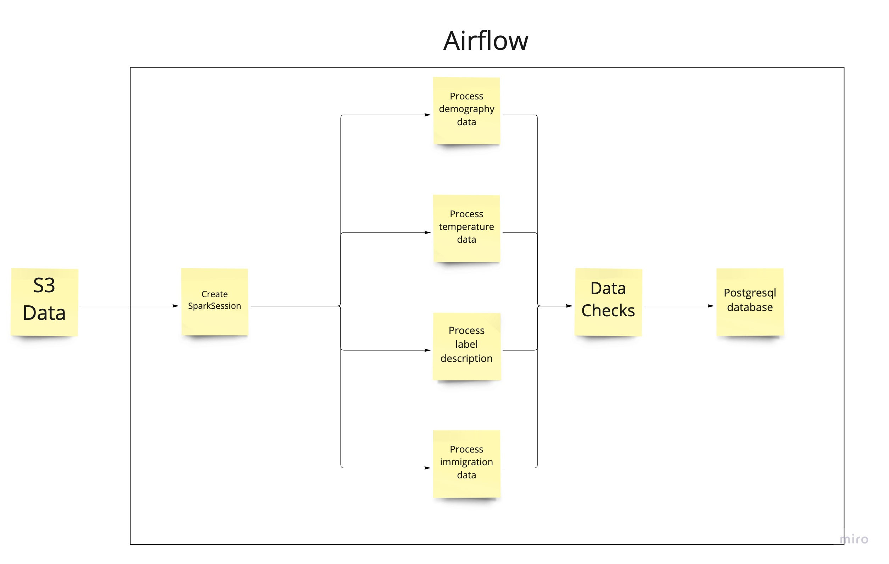

# Airflow Pipeline

[![LinkedIn][linkedin-shield]][linkedin-url]

<!-- TABLE OF CONTENTS -->
<details open="open">
  <summary>Table of Contents</summary>
  <ol>
    <li>
      <a href="#about-the-project">About The Project</a>
      <ul>
        <li><a href="#built-with">Built With</a></li>
      </ul>
    </li>
    <li>
      <a href="#getting-started">Getting Started</a>
      <ul>
        <li><a href="#prerequisites">Prerequisites</a></li>
        <li><a href="#notes">Notes</a></li>
      </ul>
    </li>
    <li><a href="#roadmap">Roadmap</a></li>
  </ol>
</details>

<!-- ABOUT THE PROJECT -->
## About The Project

This project creates data pipelines using Airflow.  
The airflow pipeline creates a spark session and after that, loads and processes the data from a local/S3 directory. After the processing is done, a data quality check is permormed and the processed data are saved to a database.  

Image below for reference:




### Built With

* [Docker](https://www.docker.com/)
* [Airflow](https://airflow.apache.org/)
* [Pipenv](https://pipenv-fork.readthedocs.io/en/latest/)


## Getting Started

To create the Airflow environment, create a .env file to specify the environment variables.
You can specify the following environment variables:

* AIRFLOW_IMAGE_NAME: Docker image name used to run Airflow (default: apache/airflow:2.2.2)
* AIRFLOW_UID: User ID in Airflow containers (default: 50000)
* AIRFLOW_GID: Airflow Group ID
* _AIRFLOW_WWW_USER_USERNAME: Username for the administrator account (default: airflow)
* _AIRFLOW_WWW_USER_PASSWORD: Password for the administrator account (default: airflow)
* _PIP_ADDITIONAL_REQUIREMENTS: Additional PIP requirements to add when starting all containers (default: '')

To initialize the Airflow database, run:

```Bash
docker-compose build
```

To start the Airflow services, run:

```Bash
docker-compose up
```

The Airflow UI can be accessed from localhost:8080.

To delete all created containers, run:

```Bash
docker-compose down --volumes --rmi all
```

### Prerequisites


### Notes


## Roadmap


[linkedin-shield]: https://img.shields.io/badge/-LinkedIn-white.svg?
[linkedin-url]: https://linkedin.com/in/stelios-giannikis